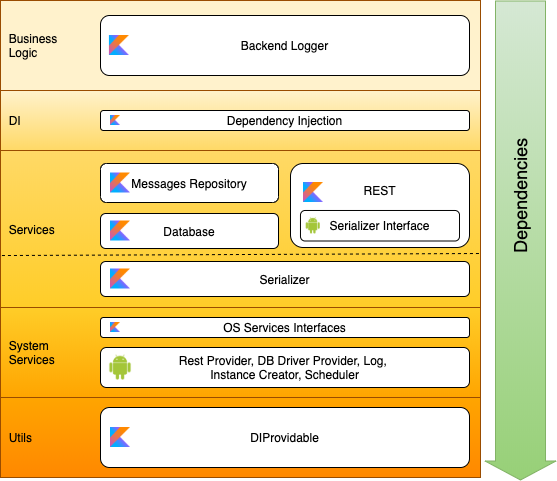

# Backend Logger
This project is provided as a sample for the Android library modularized architecture.

This library provides a way to log information to a remote server. 
The messages are persisted until sent and a retry mechanism is implemented if the operation fails.

Example of use:
```kotlin

val backendLogger = BackendLogger("https://your.domain/api/log") {
    sizeLimit = 100 // this is the default value
    retries = 10 // this is the default value
}
val message = mutableMapOf<String, Any>()
message["message"] = "Test message"
backendLogger.sendMessage(message)

```
The messages are sent as payload on a POST request to the provided URL.
They are serialized by a serializer before being sent.

Currently only a partial JSON serializer is available. This serializer currently only supports String, Number and Boolan values.

The serializer is implemented as a separate library for extendability.

Structure diagram:




Further development plan:
- add javadoc and sources to the publication
- add support for more data types in json serializer
- monitor network connection
- authentication
- option to require device idle
- option to require charging
- option to require WiFi
- option to send only when idle
- batching
